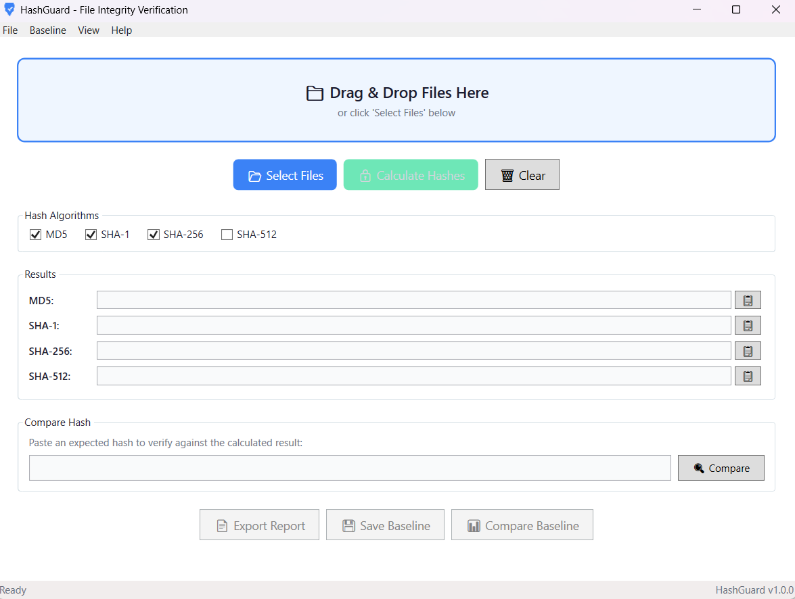

# 🛡️ HashGuard

**A professional, open-source file integrity verification tool for Windows.**

[](https://github.com/ZadgeIsCool/HashGuard/actions/workflows/build.yml)
[](LICENSE)
[](https://dotnet.microsoft.com/download/dotnet/8.0)

---

## Why HashGuard?

When you download software, firmware, or any important file, how do you know it hasn't been tampered with or corrupted? Publishers provide cryptographic hashes (checksums) for exactly this purpose — but verifying them on Windows usually means wrestling with PowerShell commands or trusting closed-source tools.

**HashGuard** gives you a clean, modern, open-source GUI to verify file integrity in seconds. No installation. No bloat. No trust issues.

---

## Features

| Feature | Description |
|---|---|
| **Multi-Algorithm Hashing** | MD5, SHA-1, SHA-256, SHA-512 |
| **Drag & Drop** | Drop files directly onto the window |
| **Batch Processing** | Hash multiple files with progress tracking |
| **Hash Comparison** | Paste an expected hash — instant match/mismatch |
| **Auto-Detection** | Identifies hash algorithm by length |
| **Export Reports** | TXT, JSON, and CSV formats |
| **Integrity Baselines** | Save snapshots, detect changes later |
| **Dark/Light Themes** | Toggle with one click |
| **Keyboard Shortcuts** | Ctrl+O, Ctrl+R, Ctrl+Shift+C |
| **Portable** | Single .exe, no installation required |
| **Open Source** | MIT license, fully auditable |

---

## Screenshots



---

## Quick Start

### Download

Go to [Releases](https://github.com/ZadgeIsCool/HashGuard/releases) and download the latest `HashGuard-win-x64.zip`. Extract and run — that's it.

### Build from Source

```bash
git clone https://github.com/ZadgeIsCool/HashGuard.git
cd HashGuard
dotnet build src/HashGuard.sln -c Release
dotnet run --project src/HashGuard/HashGuard.csproj
```

### Publish Portable Executable

```bash
dotnet publish src/HashGuard/HashGuard.csproj -c Release -r win-x64 --self-contained -p:PublishSingleFile=true
```

---

## Usage

1. **Open** — Drag files onto the window or click Select Files
2. **Choose** — Select hash algorithms (SHA-256 recommended)
3. **Calculate** — Click Calculate Hashes
4. **Verify** — Paste the publisher's hash and click Compare

For the full user guide, see [docs/USAGE.md](docs/USAGE.md).

---

## Security Notice

HashGuard is a security tool, so the integrity of HashGuard itself matters.

### Code Signing

Official releases will be code-signed when a certificate is available. Until then, Windows SmartScreen may show a warning for the unsigned executable — this is normal behavior for unsigned software and does not indicate malware.

**We strongly recommend:**
- Download only from the [official GitHub repository](https://github.com/ZadgeIsCool/HashGuard)
- Verify the release hash against values in the release notes
- Build from source for maximum assurance

### Algorithm Recommendations

| Algorithm | Strength | Recommendation |
|---|---|---|
| MD5 | Weak | Legacy compatibility only |
| SHA-1 | Deprecated | Legacy compatibility only |
| **SHA-256** | **Strong** | **Use this for security verification** |
| SHA-512 | Strong | When maximum security is needed |

HashGuard uses .NET's `System.Security.Cryptography` library, which wraps the operating system's certified cryptographic implementations (Windows CNG).

---

## Project Structure

```
HashGuard/
├── src/
│   ├── HashGuard/
│   │   ├── MainWindow.xaml          # Main application UI
│   │   ├── MainWindow.xaml.cs       # UI logic and event handlers
│   │   ├── AboutWindow.xaml         # About dialog
│   │   ├── App.xaml                 # Application entry point
│   │   ├── Services/
│   │   │   ├── HashCalculator.cs    # Core hash computation
│   │   │   ├── FileProcessor.cs     # Batch processing engine
│   │   │   ├── ReportGenerator.cs   # TXT/JSON/CSV export
│   │   │   └── BaselineManager.cs   # Integrity baseline management
│   │   ├── Models/                  # Data models
│   │   ├── Themes/                  # Dark and light theme resources
│   │   └── Resources/              # App icon
│   └── HashGuard.sln
├── tests/
│   └── HashGuard.Tests/            # xUnit test suite
├── docs/
│   ├── README.md                   # Detailed documentation
│   └── USAGE.md                    # User guide
├── .github/workflows/
│   └── build.yml                   # CI/CD pipeline
├── LICENSE                         # MIT License
├── CONTRIBUTING.md                 # Contribution guidelines
└── CHANGELOG.md                    # Version history
```

---

## Contributing

Contributions are welcome! Please read [CONTRIBUTING.md](CONTRIBUTING.md) before submitting a pull request.

### Development Prerequisites

- [.NET 8.0 SDK](https://dotnet.microsoft.com/download/dotnet/8.0)
- Windows 10/11 (required for WPF)
- Visual Studio 2022 or VS Code

### Running Tests

```bash
dotnet test src/HashGuard.sln
```

---

## License

HashGuard is released under the [MIT License](LICENSE). You are free to use, modify, and distribute it for any purpose.

---

## Acknowledgments

- Built with [.NET 8.0](https://dotnet.microsoft.com/) and WPF
- [Newtonsoft.Json](https://www.newtonsoft.com/json) for JSON serialization
- [xUnit](https://xunit.net/) for testing
- The open-source security community for inspiration
